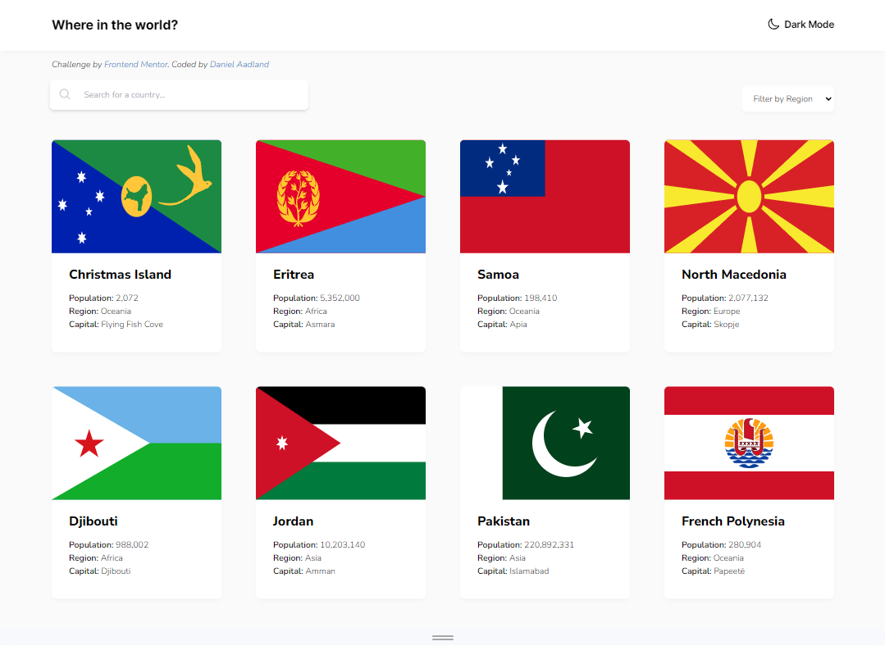

# Frontend Mentor - REST Countries API with color theme switcher solution

This is a solution to the [REST Countries API with color theme switcher challenge on Frontend Mentor](https://www.frontendmentor.io/challenges/rest-countries-api-with-color-theme-switcher-5cacc469fec04111f7b848ca). Frontend Mentor challenges help you improve your coding skills by building realistic projects. 

## Table of contents

- [Overview](#overview)
  - [The challenge](#the-challenge)
  - [Screenshot](#screenshot)
  - [Links](#links)
- [My process](#my-process)
  - [Built with](#built-with)
  - [What I learned](#what-i-learned)
  - [Continued development](#continued-development)
  - [Useful resources](#useful-resources)
- [Author](#author)

## Overview

### The challenge

Users should be able to:

- See all countries from the API on the homepage
- Search for a country using an `input` field
- Filter countries by region
- Click on a country to see more detailed information on a separate page
- Click through to the border countries on the detail page
- Toggle the color scheme between light and dark mode *(optional)*

### Screenshot

### Links

- Solution URL: [Add solution URL here](https://your-solution-url.com)
- Live Site URL: [Add live site URL here](https://your-live-site-url.com)

## My process

### Built with

- Semantic HTML5 markup
- CSS custom properties
- Flexbox
- CSS Grid
- Mobile-first workflow
- [React](https://reactjs.org/) - JS library
- [Next.js](https://nextjs.org/) - React framework
- [heroicons](https://heroicons.com/) - For SVG icons

### What I learned

In this challenge I learned how to pull data from an API and practiced creating reusable components that can dynamically render based upon that data.

Something I struggled with was making the way my components rendered flexible enough to account for if a country's object didn't have any given property, as well as making sure the page didn't fail to compile if the API failed to respond. I also had problems with `useEffect()` hooks getting stuck in infinite loops with sending requests to the API. 

I also learned how to create a dark mode theme using Tailwind. To handle toggling between dark and light mode, I created a parent component to act as a container for both the body elements and Heading component and to hold the `dark` property that tells child components to use their styles tagged with `dark:`, but I'm unsure if this is the best way to handle a dark mode toggle in Next.js.

### Continued development

Going further I'd like to further develop my understanding of state and asynchronous functions and promises. I struggled a lot with infinite loops and states being updated after the rest of a function finishes. 

One feature that I couldn't figure out was rendering bordering countries using their common names instead of 3 character country code in the Country Details page. In order to accomplish this I would imagine another asynchronous function would be needed to fetch them from the the REST API based on the codes found in the object of the current country, but I couldn't get it to work. I might go back and try to fix this after deepening my understanding of API requests, React hooks and JS promises.

### Useful resources

- [freeCodeCamp - How to Consume REST APIs in React - a Beginner's Guide](https://www.freecodecamp.org/news/how-to-consume-rest-apis-in-react/) - This helped me get started making requests from the REST countries API. I'll definitely be rereading this to get a better understanding of handing APIs in React.
- [Next.js Documentation - Dynamic Routes](https://nextjs.org/docs/pages/building-your-application/routing/dynamic-routes) - I had trouble getting multiple pages to display, so I dove into the documentation to see how routes are currently handled.

## Author

- Website - [Daniel Aadland](https://portfolio-website-rgm2jbtrb-greencitrus6s-projects.vercel.app/)
- Frontend Mentor - [@GreenCitrus6](https://www.frontendmentor.io/profile/GreenCitrus6)
